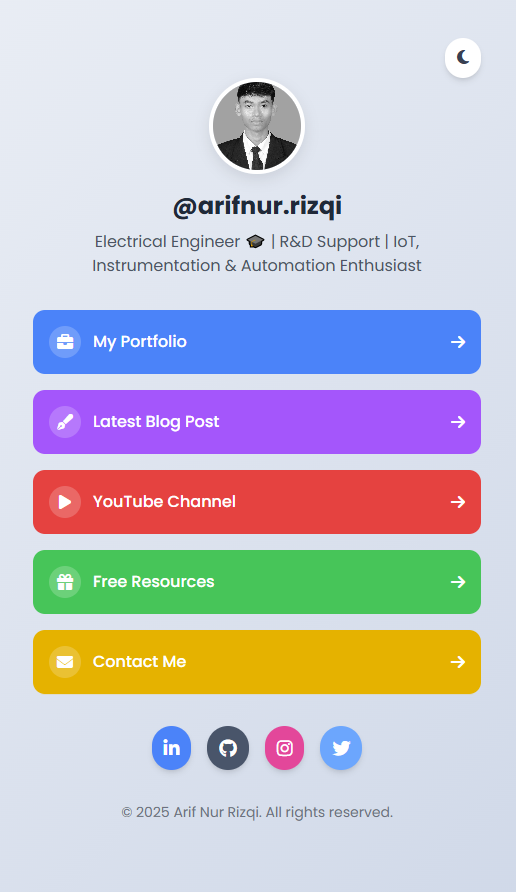

# Creative Linktree Website by Arif Nur Rizqi

A visually appealing and modern Linktree-style personal landing page built using **HTML**, **Tailwind CSS**, and **Font Awesome**. It features a profile section, dark mode toggle, animated ripple effects, dynamic link generation, and social media integration.



## 🔗 Live Demo

Host this project for free using [Netlify](https://netlify.com). For example: [https://link-arif.netlify.app](https://link-arif.netlify.app)

---

## 🚀 Features

* Responsive & Mobile-Friendly
* Light / Dark Mode Toggle
* Dynamic Links (Easily editable via JavaScript)
* Ripple Click Effects
* Font Awesome Icons
* Tailwind CSS Styling
* Clean, Commented Code

---

## 🛠️ How to Use

### 1. Clone or Download

```bash
# Clone the repo
git clone https://github.com/arifnurrizqi/link-tree.git

# Or just download the ZIP and extract it
```

### 2. File Structure

```
creative-linktree/
├── index.html          # Main HTML file
├── img/
│   └── profile.jpg     # Your profile image
├── README.md           # This file
```

### 3. Customize

#### 👤 Profile Info

Edit the profile section in `index.html`:

```html
<h1 class="text-2xl font-bold">@arifnur.rizqi</h1>
<p>Electrical Engineer 🎓 | R&D Support | IoT, Instrumentation & Automation Enthusiast</p>
```

#### 📷 Profile Picture

Replace `img/profile.jpg` with your own image (use same name or update the `src` path).

#### 🔗 Links

Edit the JavaScript array `links` inside `<script>` tag at the bottom of `index.html`:

```js
const links = [
  {
    title: "My Portfolio",
    url: "https://arifnr.my.id/",
    icon: "fa-briefcase",
    color: "bg-blue-500",
  },
  // Add or remove more items here
];
```

#### 🌐 Social Media

Update the `<a>` tags inside the social section:

```html
<a href="https://github.com/arifnurrizqi" target="_blank">
  <i class="fab fa-github"></i>
</a>
```

---

## 🌍 Deploying to Netlify

### Option 1: Deploy Manually

1. Go to [https://netlify.com](https://netlify.com)
2. Sign up / Log in
3. Click **"Add new site" > "Deploy manually"**
4. Drag & drop your project folder (including `index.html`) into the upload area

### Option 2: Deploy with GitHub

1. Push your code to a GitHub repo
2. In Netlify, click **"Add new site" > "Import from Git"**
3. Connect your GitHub account and select the repo
4. Netlify will automatically build and host your site!

---

## 📦 Dependencies

* [Tailwind CSS CDN](https://cdn.tailwindcss.com)
* [Font Awesome CDN](https://cdnjs.com/libraries/font-awesome)

No build tools or frameworks needed. Pure HTML/CSS/JS.

---

## 📄 License

MIT License

---

## 👋 Author

**Arif Nur Rizqi**
[LinkedIn](https://www.linkedin.com/in/arifnurrizqi/) | [GitHub](https://github.com/arifnurrizqi) | [Portfolio](https://arifnr.my.id)

Feel free to fork and customize this for your own use!
